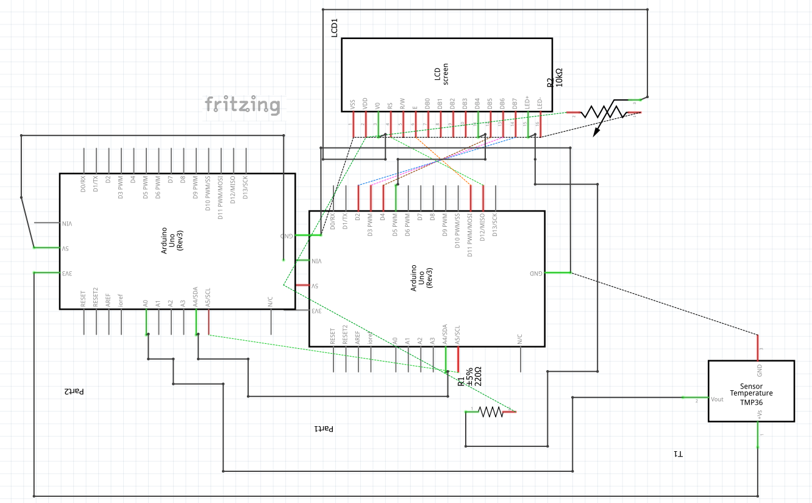
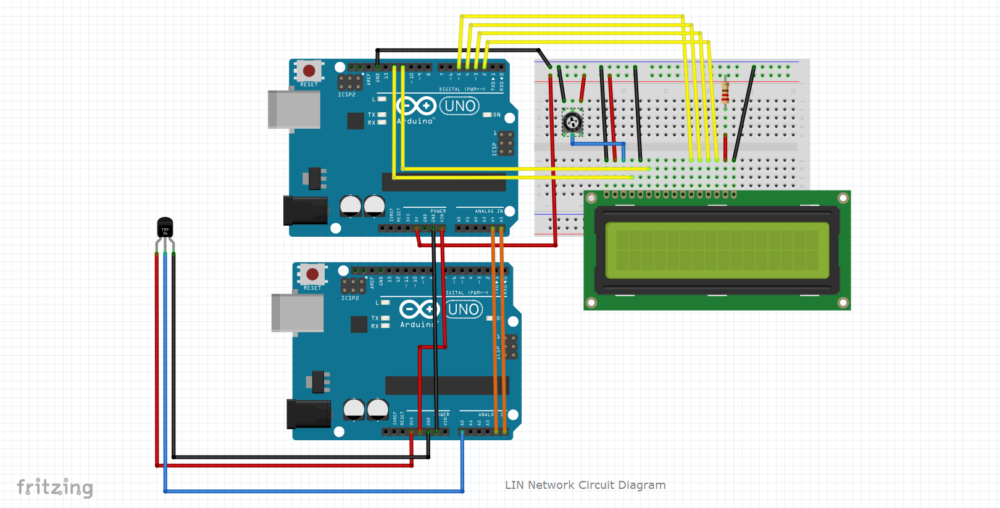

# Local Interconnect Network (LIN)-based Arduino Network

## Scope
The system scope is to develop a LIN based network using two Arduino hardware components along with few sub components such as sensor and led display which should have the capability to transfer sensor data from one Arduino to another Arduino in the network and display the output to a connected display.

## Requirements
The requirement of the system is to design, implement and present an embedded system networked between two Arduinos to implement Local Interconnect Network (LIN) functionality and transfer data from master device to slave device.

## What is Local Interconnect Network (LIN) Bus
LIN (Local Interconnect Network) is a network protocol based on Serial Communication Interface (SCI) used mainly to implement communication among automobile components like doors, roof top, steering. The Local Interconnect Network (LIN), standardized with ISO17897, is a low-cost, multipoint and easily-implemented communication bus in vehicles, working as a sub-bus along with Controller Area Network (CAN) in most of the applications.

With the outgrowth of internal communication among automobile components it was required to design a network protocol that should be less expensive and able to implement communication between components which don’t required high competency, and speed in operations such as vehicle doors, roof tops and headlights as compare to existing CAN. LIN is a serial interface network came into existence as a technology in the car manufacturing industry with the growth of the industry, on the other hand the CAN bus was very expensive to implement for low fault tolerance component in cars.

## Features of LIN bus
•	It used mostly for vehicle windows, steering, wipers and air conditioning control etc.
•	It best low-cost option for less fault tolerance & speed critical components in a car.
•	Provides time triggered scheduling with guaranteed latency time.
•	There is no chance of conflict in communication because master node controls the communication and slaves are not allowed to communicate directly.
•	Its operating voltage range from 9V and 18V.
•	It consists of a single wire connection plus a ground wire with 1-20 kbits at max.
•	The slave node message varies in data length from 2, 4, 8 bytes.
•	Wakeup and sleep mode is supported.

## How does LIN bus work?
At its core LIN communication is relatively simple:

A master node connects with bus and iteration through each of the slave nodes, sending a header request for information - and each slave reacts with / without data when questioned. The data in bytes are transmitted in the form of signals over the LIN.

Simply, we can say that LIN bus message frames transmitted over the bus are of a header and a response.

Specifically, LIN master node transmits header bytes over the LIN bus and this kicks off a slave, which sends either 2, 6 or 8 bytes of data in response.

## Design Approach
Since LIN bus uses Master / Slave approach so, we will use the same master / slave approach to implement communication between two Arduino controllers to setup LIN Network. Master device shall be connected with computer and interact with a software to receive instructions. We will use a TMP36 temperature sensor as an input component. We will use LCD to display the output.

## Notes:
Our final circuit might be little different from the below circuit diagram to implement the best practices and procedures.
 
## Schematics

## Breadboard

## Hardware Required
-	Two Arduino UNO
-	One breadboard
-	One TMP36 temperature sensor
-	One 16 pin LCD Display
-	Connecting Wires
-	Bunch of resistors (ranging from 200 Ohm to 300 Ohm)
-	Jumper Cables (Multiple)
-	Multimeter for debugging
-	Potentiometer Trimmer 12mm 10KOham Linear track
-	1 USB wire to connect with computer

Group Members
* _Faheemuddin Mohammed_
* _Mudassar Manzoor_
